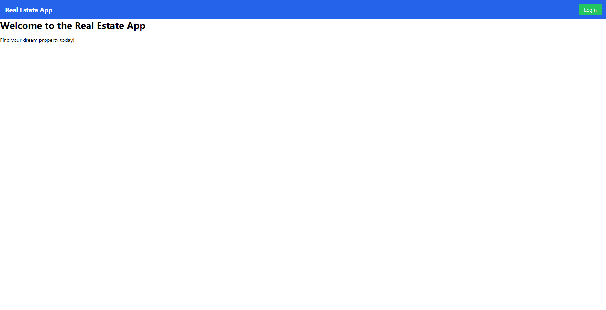
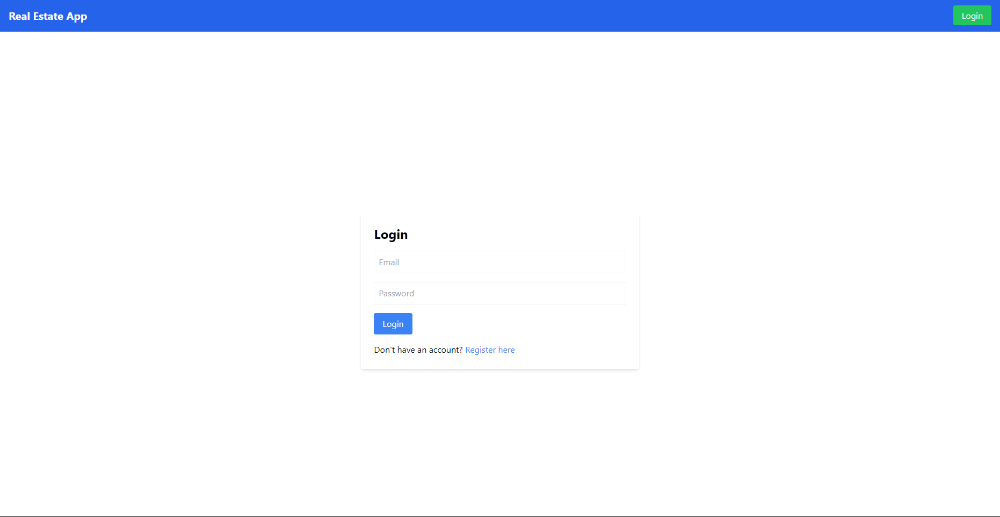
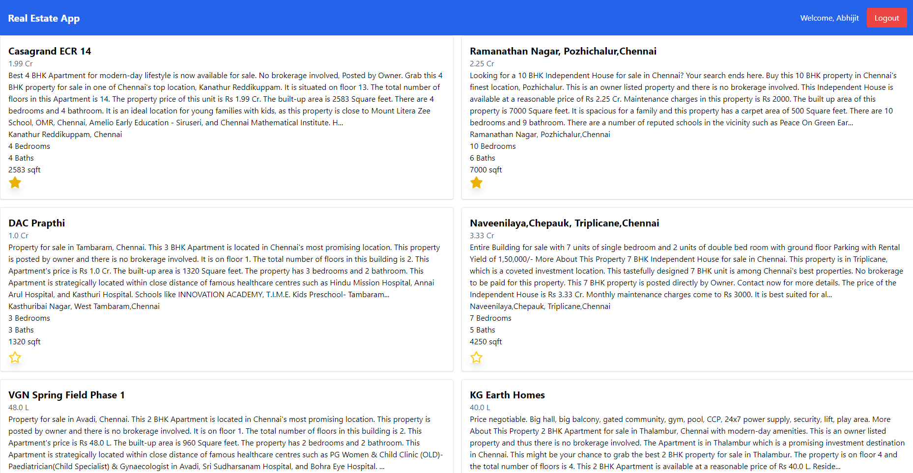
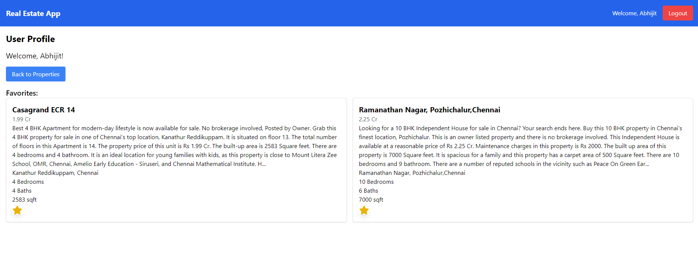

# Real Estate Application

A full-stack real estate application built with **Node.js** (backend) and **React.js** (frontend). Users can browse properties, mark their favorites, and register/login to manage their profile and saved properties. The backend is deployed on **Render**, and the frontend is deployed on **Vercel**.

## Table of Contents

- [Features](#features)
- [Tech Stack](#tech-stack)
- [Getting Started](#getting-started)
- [Frontend Setup](#frontend-setup)
- [Backend Setup](#backend-setup)
- [Environment Variables](#environment-variables)
- [API Endpoints](#api-endpoints)

## Features

- User registration and login with JWT authentication.
- Browse properties with detailed information (price, bedrooms, baths, etc.).
- Favorite properties for quick access.
- User-specific profile page displaying favorited properties.
- Responsive design for mobile and desktop devices.

## Tech Stack

### Frontend:
- **React.js**
- **TailwindCSS** for styling
- **Vercel** for frontend deployment

### Backend:
- **Node.js**
- **Express.js**
- **MongoDB** (via Mongoose)
- **JWT** (JSON Web Token) for authentication
- **Render** for backend deployment

### Other Tools:
- **dotenv** : for environment variable management
- **bcrypt.js** : for password hashing
- **CORS** : for cross-origin resource sharing

## Getting Started

To get a local copy of the project up and running, follow these steps.

### Prerequisites

Make sure you have the following installed:
- [Node.js](https://nodejs.org/en/download/)
- [npm](https://www.npmjs.com/get-npm)
- [MongoDB](https://docs.mongodb.com/manual/installation/)

## Frontend Setup

1. **Clone the repository**:
    ```bash
    git clone https://github.com/M-Abhijit07/real-estate.git
    ```

2. **Install dependencies**:

    ```bash
    npm install
    ```

3. **Start the frontend development server**:

    ```bash
    npm start
    ```

The frontend should now be running on ```http://localhost:3000```.

## Backend Setup

1. **Navigate to the backend directory**:

    ```bash
    cd ./backend
    ```

2. **Install dependencies**:

    ```bash
    npm install
    ```

4. **Set up environment variables**:

    Create a ```.env``` file in the ```./backend``` directory and add the following:

    ```makefile
    MONGODB_URI=your_mongodb_connection_string
    JWT_SECRET=your_jwt_secret_key
    ```

5. **Start the backend server**:

    ```bash
    node index.js
    ```

The backend should now be running on ```http://localhost:5000```.

## Environment Variables
Here are the environment variables required for the backend:

- ```MONGODB_URI```: MongoDB connection string.
- ```JWT_SECRET```: Secret key for signing JWT tokens

## API Endpoints
### Authentication:
- ```POST /api/auth/register```: Register a new user.
- ```POST /api/auth/login```: Login and receive a JWT token.
### Properties:
- ```GET /api/properties```: Get a list of all properties.
- ```POST /api/properties```: Add a new property (admin use only).
- ```GET /api/properties/:id```: Get details of a single property.
### User:
- ```PATCH /api/auth/update-favorites```: Update the list of a user's favorite properties.
- ```GET /api/auth/user```: Fetch user profile and favorites.

## Pictures

<table>
  <tr>
    <td></td>
    <td></td>
  </tr>
  <tr>
    <td></td>
    <td></td>
  </tr>
</table>